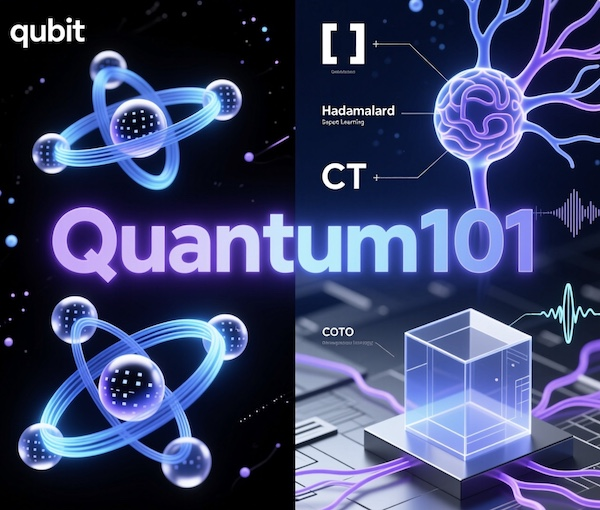

# Quantum101
An introduction to quantum computing and quantum deep learning (QDL). 

---

## 📚 Description / 專案簡介

**English**  
A comprehensive and hands-on introduction to quantum computing and quantum deep learning (QDL), designed for beginners and intermediate learners. This repository covers fundamental concepts—from qubits, quantum gates, and Bloch sphere visualization to quantum circuits in Qiskit and Cirq—and progressively builds toward modern applications such as quantum random number generation, quantum sorting, and the foundations of quantum deep learning. Includes executable code examples, step-by-step explanations, and visualizations to bridge theoretical understanding with practical implementation. Perfect for students, researchers, and developers diving into the intersection of quantum computing and artificial intelligence.

**繁體中文**  
這是一個全面且注重實作的量子計算與量子深度學習（QDL）入門資源，專為初學者及中階學習者設計。本專案從基礎概念出發，涵蓋量子位元（qubit）、量子閘、布洛赫球視覺化，到使用 Qiskit 與 Cirq 建構量子電路，並逐步延伸至現代應用，如量子亂數生成、量子排序，以及量子深度學習的核心原理。內容包含可執行的程式範例、逐步解析與視覺化圖示，旨在串聯理論與實務。無論是學生、研究人員或開發者，只要想探索量子計算與人工智慧的交叉領域，這裡都是理想的起點。

---
